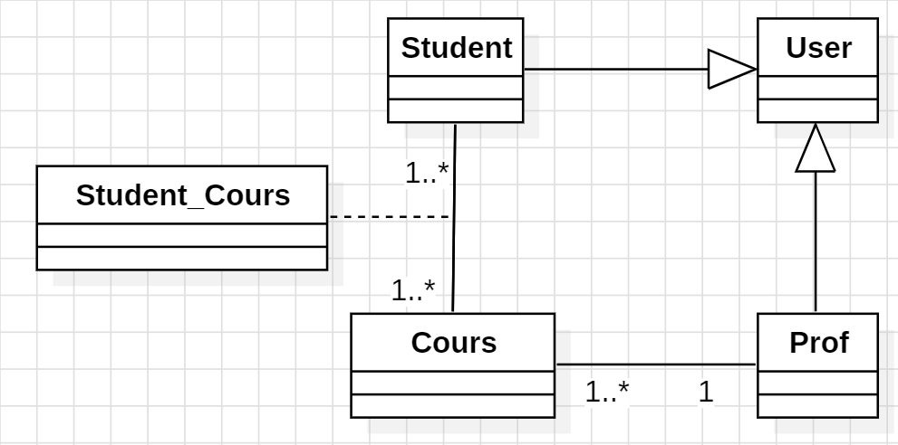
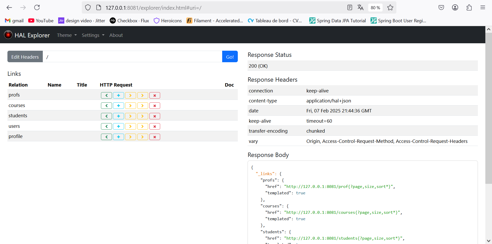
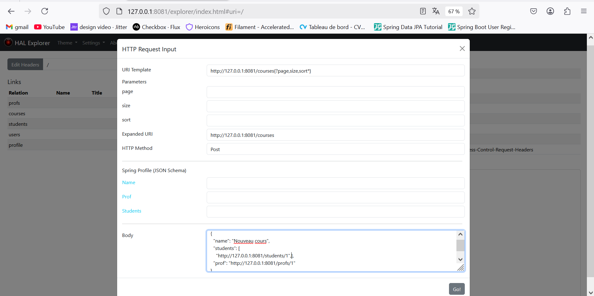

# 📌 REST API - Gestion des Cours, Étudiants et Professeurs

## 📝 Description  
Cette API REST permet de gérer les cours, les étudiants et les professeurs en utilisant **Spring Data REST Repositories**.  
Elle repose sur une approche **sans implémentation manuelle des méthodes CRUD**, mais vous pouvez les spécifier si nécessaire.  
Les tests des endpoints sont effectués avec **HAL Explorer**.

## 🎯 Objectifs  
✔️ Développer un CRUD avec un **effort minimal** en utilisant **Spring Data REST**.  
✔️ Apprendre à **définir les relations et les cardinalités** entre les entités.  
✔️ Comprendre **les jointures** et leur fonctionnement dans Spring Data JPA.  
✔️ Tester l’API avec **HAL Explorer**.

---

## 🖼️ Image de conception  

---

## 🏗️ Architecture du projet  
```
│   CrudRestApisApplication.java
│
├───DAO
│   └───repository
│           CourseRepository.java
│           ProfRepository.java
│           StudentRepository.java
│           UserRepository.java
│
└───metier
    └───entity
            Course.java
            Prof.java
            Role.java
            Student.java
            User.java
```
---

## 🔍 HAL Explorer & Spring Data REST Repositories  

### 🔹 HAL Explorer  
**HAL Explorer** est un outil permettant de **naviguer dans l'API REST** facilement et de tester les endpoints générés automatiquement par Spring Data REST.  
📌 Une fois l'application démarrée, accédez à **`http://localhost:8081`** pour utiliser HAL Explorer.

### 🔹 Spring Data REST Repositories  
Spring Data REST expose automatiquement des endpoints REST pour les entités définies dans les **repositories**.  
Par exemple :  
- **GET /courses** → Récupérer la liste des cours.  
- **POST /courses** → Ajouter un nouveau cours.  
- **GET /courses/{id}** → Récupérer un cours par son ID.  
- **DELETE /courses/{id}** → Supprimer un cours.  

⚡ **Personnalisation possible** : Vous pouvez **spécifier vos propres méthodes** si nécessaire en annotant les `@RepositoryRestResource`.

---

## 🖼️ Resultat 


